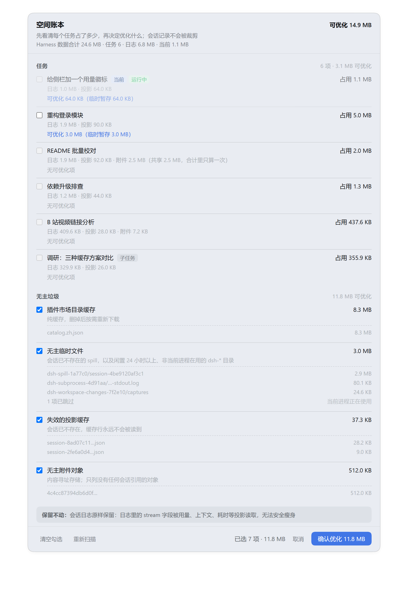
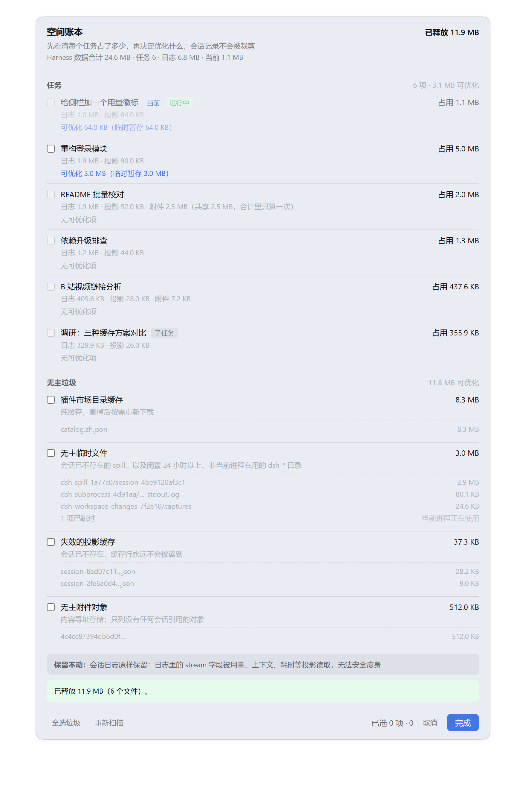
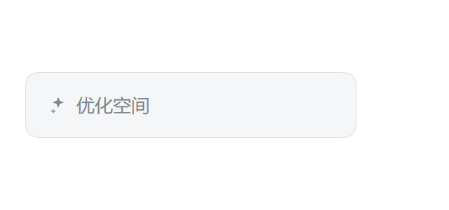
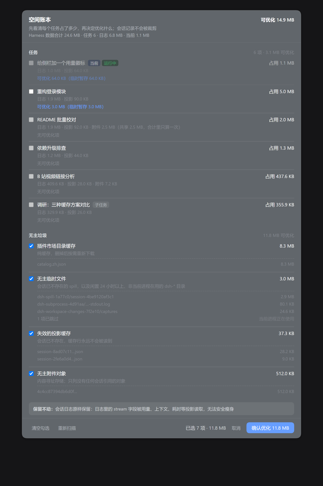

# dsh-space-optimizer

侧栏底部常驻的 **「优化空间」** 按钮：点开是一份**空间账本**——每个任务占了多少、
其中多少能优化、以及不属于任何任务的无主垃圾——**核对清楚之后再逐项勾选确认**。

```
占用 5.0 MB · 可优化 3.0 MB · 无主垃圾 8.3 MB · 已释放 11.7 MB
```

**它只回收"无主垃圾"，绝不裁剪对话记录。** 每个任务占的大头（会话日志）是规范状态，
被用量、上下文、耗时等多个投影读取，因此账本只把它**列出来**、不提供任何瘦身手段。
能优化的只有三类**附属产物**：落盘的超大工具输出、被取代的旧格式日志、无人引用的附件。

## 截图

| 空间账本（浅色） | 优化完成 |
|---|---|
|  |  |

| 按钮位置（侧栏底部） | 深色主题 |
|---|---|
|  |  |

> 截图由 `node tools/render-panel.mjs` 生成：把**真实组件**渲染成 HTML（主题变量取自
> 已安装的 `dsh-client-ui-theme`），再用无头 Chrome 出图。**图中的任务名与路径是虚构样本**，
> 不是任何人的真实数据。

## 快速上手

1. 装：`dsh plugin --profile web add github:OWNER/dsh-space-optimizer`，刷新页面。
2. 点侧栏底部 **「优化空间」**，等 1～2 秒扫描（实测 9 个任务约 170 ms）。
3. 看清每一行之后：无主垃圾默认已勾选，**任务级项目要你自己勾**，然后点 **「确认优化」**。

面板底部实时显示「已选 N 项 · 可释放 X」；优化完成后给出「已释放 X（N 个文件）」。
不放心就先别勾——**扫描是纯只读的，不点确认不会动任何一个字节**。

## 界面

按钮挂在 `sidebar.footer.action`（和 token 费用徽标同一排，侧栏收起时只剩图标）。
点开面板分两段：

**任务**（每个会话一行，当前任务置顶并标注）

| 列 | 含义 |
|---|---|
| 占用 | 该任务在磁盘上**独占**的字节 = 日志 + 投影缓存 + 可优化项 |
| 日志 | `~/.dsh/sessions/<项目>/<会话>/session.v4.jsonl.zstd` 当前 generation |
| 临时暂存 | 该任务落盘的超大工具输出（`%TEMP%\dsh-spill-<id>\session-<hash>\`） |
| 可优化 | = 临时暂存 + 被取代的旧 generation |
| 引用附件 | 该任务引用的附件；共享的会标出来，**合计里只算一次** |

标签：`当前`（主视图打开的那个）、`运行中`、`子任务`（`origin: subagent`，侧栏不显示但确实占空间）。
**运行中与当前任务不可勾选**——它的临时文件可能还在被读。

**无主垃圾**（不属于任何任务）

| 类别 | 判定 |
|---|---|
| 插件市场目录缓存 | 纯缓存，删了下一次打开插件市场会重新下载 |
| 无主临时文件 | ① 对应会话已不存在的 spill；② 闲置超过门槛、且不是当前进程在用的 `%TEMP%\dsh-*` |
| 失效的投影缓存 | `session_projcache` 里对应会话已经不存在的行 |
| 无主附件对象 | 没有任何会话日志引用的附件 |

底部显示「已选 N 项 · 可释放 X」，确认后才发回收请求。

**默认勾选策略**：无主垃圾默认勾上（本来就是垃圾）；**任务级项目默认不勾**——
清理任务级 spill 会让那段超大工具输出的**全文**只剩摘要，得由你自己点头。

## 口径：什么算"这个任务占的空间"

- **会话日志不是垃圾。** `dsh-session` 的事件契约里 `assistant/message.stream` 是必填字段，
  而 `dsh-token-meter`、`dsh-client-ui-chat`、`dsh-session-stats`、`dsh-api-session-controller`、
  `dsh-subagent`、`dsh-session-persistence-jsonl`、`dsh-client-connection` 都靠它重算
  用量 / 上下文 / 首 token 耗时。任何"拆字段瘦身"都会打坏这些投影，所以日志**只统计、不裁剪**。
- 因此一个任务真正能安全优化的只有两处**附属产物**：落盘的临时暂存、以及被取代的旧格式日志。
- 附件是内容寻址存储（相同字节只存一份），所以按引用归属到任务，但总量只算一次；
  一个任务被删之后它独占的附件才变成无主垃圾。

## 安全设计

- **路径不出 Host。** 渲染进程只能回传 Host 生成的 `targetId`（`sha1(路径)` 前 16 位）；
  回收时 Host **重新扫描一遍**，只删本次仍然存在、且本次判定为可回收的目标。
  认不出来的 id 一律忽略并如实回报 `stale` 数量（说明界面上的账本已经过期）。
- **不接受"清空一切"。** 回收接口要求显式列出 targets，没有省略即全删的写法。
- **回收接口要求一个自定义头**（`x-space-optimizer`）。这条路由挂在无需授权的本地
  web server 上：浏览器对跨源**简单请求**不拦发送（只是不让读响应），所以一个被访问的
  网页原本可以匿名 POST 过来造成删除。带自定义头必然触发预检，而 Host 不应答预检，
  于是浏览器不会发出真实请求。同时拒绝 `sec-fetch-site: cross-site`。
  （本地进程仍可调用，但它本来就能直接删这些文件，不是这条防线要挡的东西。）
- **删除前重新确认。** 按闲置时长判定的条目会在删除前再 stat 一次，避免和刚写入的进程抢；
  删不掉的文件（被占用）记录进 `failures`，不中断整次回收。
- **保守优先。** 只要有一份会话日志读不通，就无法证明某个附件"无主"——
  该类别整体放弃回收，并在界面上标注原因。同理，最新 generation 校验失败时，
  它下面的旧 generation 一律不删（无法证明"高版本能读"）。
- 不跟随符号链接；空的 `%TEMP%\dsh-*` 根目录在内容清空后一并收走。
- **spill 归属靠复现官方哈希**：`session-` + `sha256(sessionId)` 前 12 位
  （见 `dsh-spill-local` 的会话目录规则），所以"属于仍在的会话"和"真孤儿"能分得清——
  这条规则是必需的：日志里存的是 spill 文件**路径**，删错就是那条对话永久读不回那段输出。

## 安装

**方式一：直接从 GitHub 装（发布后的正式方式）**

```sh
dsh plugin --profile web add github:OWNER/dsh-space-optimizer
```

刷新页面，侧栏底部出现「优化空间」。卸载：`dsh plugin --profile web remove dsh-space-optimizer`。

**方式二：本地源码开发**

| 位置 | 说明 |
|---|---|
| `<工作区根>\plugins\dsh-space-optimizer` | **源码**，改这里 |
| `<插件安装根>\dsh-space-optimizer` | 指向源码目录的目录联接（junction），作为安装源路径 |
| `…\.dsh\profiles\desktop\node_modules\dsh-space-optimizer` | 指向 `<插件安装根>\…` 的目录联接 |

profile 的 `package.json` 里登记为组合包（必须用 pnpm 的 `link:` 协议，
`file:` 会把目录复制进 `node_modules`，之后改源码不生效）：

```json
"dependencies": { "dsh-space-optimizer": "link:<插件安装根>/dsh-space-optimizer" },
"dsh": { "profile": { "bundles": [ "…", "dsh-space-optimizer" ] } }
```

## 文件

| 文件 | 作用 |
|---|---|
| `package.json` | 插件清单：`dsh.bundle.patch` 与 `dsh.client`（`platform: web`、`immediately`、`inject: dsh-client-ui-sidebar`） |
| `lib/space.js` | 账本与回收核心（纯文件系统，无 Cordis / 无 React 依赖） |
| `index.js` | Host 半侧：`/space-optimizer/ledger`、`/space-optimizer/reclaim`、`/space-optimizer/config` |
| `client.js` | 浏览器半侧：侧栏按钮 + 账本面板（构建产物直接提交，git 安装不跑构建） |
| `cordis.patch.yml` | 组合包 patch：插入 `space-optimizer` 行 |
| `screenshots.json` | 市场商店页截图声明（1–8 张仓库内相对路径） |
| `assets/` | 截图与出图用的中间 HTML |
| `tools/space-report.mjs` | **只读**命令行账本：`node tools/space-report.mjs [--json]` |
| `tools/space-optimizer-test.mjs` | 30 项离线断言（账目 + 回收语义） |
| `tools/client-panel-test.mjs` | 34 项离线断言（假 React 真渲染面板、交互请求体、协议异常） |
| `tools/lib/harness.mjs` | 共用的假 React / 模块加载 harness |
| `tools/render-panel.mjs` | 从真实组件出截图（无头 Chrome/Edge） |
| `PUBLISHING.md` | 投稿到插件市场的完整流程与检查表 |

> **对宿主 Node 的依赖**：账本要解开 Zstandard 帧，用的是 Node 内置 `zlib.zstdDecompressSync`。
> 这不是额外要求——官方 `dsh-session-persistence-jsonl` 写这些日志用的就是同一套内置 API，
> 所以任何能写出这种日志的 DSH 运行时都必然具备它。

## 可调配置

Host 半侧的 `apply(ctx, config)` 接受：

| 字段 | 默认 | 说明 |
|---|---|---|
| `home` | `$DSH_HOME` | Harness 家目录 |
| `tempDir` | 系统临时目录 | 扫描 `dsh-*` 暂存的位置 |
| `minIdleHours` | `24` | 无会话归属的临时文件要闲置多久才算过期 |
| `marketCacheMinAgeHours` | `1` | 市场缓存的最小年龄（它有 6 小时 TTL） |

## 改完代码怎么生效

**客户端半侧（`client.js`）不用重启**：客户端模块表在条目被移除后重新加入时会重新读文件。

1. **不重启（推荐）**：侧栏「插件」页找到 `dsh-space-optimizer`，开关关掉再打开。
2. **等价的文件做法**：把该包从 profile 的 `dsh.profile.bundles` 里删掉，等几秒
   （`dsh-hmr` 会重新组合 profile，旧路由立刻 404），再加回末尾。

**Host 半侧（`index.js` / `lib/`）必须重启 Harness。** 实测结论：摘掉插件行再挂回去
（`/space-optimizer/ledger` 先 404、再 200）之后，`index.js` 里的改动**依然没生效**——
因为 Node 的 ESM 模块缓存命中了同一个模块 URL，重组 Loader 行不会重新 import 文件。
所以改了 Host 逻辑要重启 Harness（会中断正在执行的会话），或者先只按上面的流程验证客户端改动的样式与交互。

> 版本错配是安全的：新版客户端会带上防跨源自定义头，旧版 Host 直接忽略它；
> 新版 Host 要求该头，而新版客户端一定会带。两种组合都能正常工作。

## 测试

```
node tools/space-optimizer-test.mjs   # 30 项：账目口径、spill 归属、附件引用归属、
                                      #   坏日志保守规则、只删点名项、全选也不碰会话日志
node tools/client-panel-test.mjs      # 29 项：假 React 真渲染面板，默认勾选策略与请求体
node tools/space-report.mjs           # 只读账本；确认这个脚本永远不会删东西
```

两个套件的退出码都必须为 0。

## 投稿到插件市场

社区精选目录 [awesome-dsh-plugin](https://github.com/awesome-dsh-plugin/awesome-dsh-plugin)
（`dsh-plugin.org` 的 11029 条已验证条目即由它同步）用 **一个仓库一个 YAML** 收录，规则是：

| 要求 | 本仓库状态 |
|---|---|
| `package.json` 声明 `dsh.bundle`（只声明 `dsh.client` 不可安装） | ✅ `dsh.bundle.patch` |
| 仓库创建满 1 天 | ⏳ 发布后需等 1 天再提 PR |
| 仓库带 `dsh-plugin` topic | ⏳ 建仓后设置 |
| 构建产物已提交（git 安装不跑构建） | ✅ `client.js` 即产物 |

投稿内容是 `data/plugins/<owner>__dsh-space-optimizer.yml` 这一个文件：

```yaml
url: https://github.com/OWNER/dsh-space-optimizer
name: OWNER/dsh-space-optimizer
category: session
description:
  en: Per-task disk-space ledger in the sidebar with opt-in reclamation of unowned junk; session logs are never trimmed.
  zh: 侧栏里的每个任务磁盘占用账本，可勾选回收无主垃圾；会话日志绝不被裁剪。
```

分类选 `session`（「💬 会话与消息」）：账本按会话组织，同类条目 `dsh-session-sweeper`、
`dsh-session-delete`、`dsh-archived-conversations` 都在这个分类下。
**描述里若含英文冒号加空格必须加引号**，否则 YAML 会解析失败。

## 常见问题

**为什么我的任务几乎都显示"无可优化项"？**
因为一个任务占的大头是会话日志，而它**没有安全瘦身空间**（见上方口径）。能优化的是
三类附属产物，多数任务本来就不产生它们。这个插件的首要价值是**让你第一次看清空间去哪了**，
其次才是释放。

**清理"临时暂存"会毁掉那段对话吗？**
不会毁掉对话。日志里存的是 spill 文件的**路径**，删掉后那段超大工具输出的**全文**读不回来
（界面上只剩摘要），但对话正文、思考过程、工具调用、最终答案、代码改动都完好。
正因如此，这类项目**默认不勾选**，需要你逐个任务点头。

**为什么运行中和当前任务不能勾？**
它的临时文件可能还在被读，删了会打坏正在跑的任务。面板会把它们标成 `运行中` 并禁用勾选，
但**占用照常统计**，所以你能看到当前任务的体积。

**为什么各类数字加起来和"总占用"对不上？**
附件是内容寻址存储（相同字节只存一份），所以按引用归属到任务、**总量只算一次**：
被多个任务引用的附件会在多行出现，并在行内标注"共享 X，合计里只算一次"。
每个任务的「占用」是它**独占**的字节，相加不会重复计数。

**删掉的东西能恢复吗？**
不能，回收不走回收站（这样才真的释放空间）。所以界面上不做"全选任务级项目"的默认行为，
也不提供"清空一切"的接口——每次都要显式列出要删什么。

**会把我的数据发出去吗？**
不会。Host 半侧只做本地文件系统操作，插件自身不发任何网络请求；
扫描结果是本地 JSON，只回给本机的这个页面。

**扫描会不会很慢或很吃 CPU？**
实测 9 个任务、约 8 MB 日志，扫描 170 ms。它要解开每个会话日志的 Zstandard 帧
（帧是官方按批次追加的）来统计附件引用，所以任务很多时是线性的，但只在打开面板和点扫描时跑。

**改了 Host 代码为什么不生效？**
`client.js` 摘挂插件行即可热更新；`index.js` / `lib/` 因为 Node 的 ESM 模块缓存
（junction 会解析到同一真实路径）必须重启 Harness。详见「改完代码怎么生效」。

## 已知边界

- **面板上的数字会随任务增长**：会话日志本身占大头（约 0.8 MB/任务），而它无法安全瘦身；
  真正随任务稳定产生的可回收垃圾不到 0.2 MB/任务。
- **插件市场缓存是一次性收益**：删掉之后下一次打开插件市场会重新下载，第二次点就没得清了。
- **归档会话的日志不会被回收**：官方 `dsh-session-persistence-jsonl` 明确写着
  「Nothing deletes session files」，归档也没有取消归档的入口，所以这些会话仍按
  普通任务计入账本，只是侧栏不显示。
- **跨进程的临时文件只能按时间猜**：`dsh-subprocess-*` / `dsh-workspace-changes-*`
  的文件名里没有会话归属信息，只有 pid（能判断"当前进程在用"），所以这两类走
  闲置时长门槛；太新的会被如实标为"还太新，保留"。
